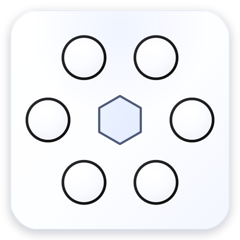
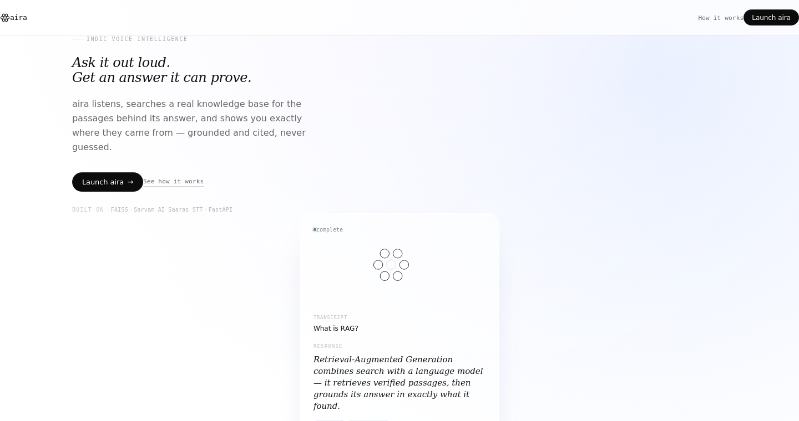

<div align="center">



# aira — landing page

**Marketing site for [aira](https://voice-rag-pipeline.onrender.com/), a voice-native RAG assistant for Indic languages.**
Static. No backend. No build step.

[](#)
[](https://aira-ten-flax.vercel.app/)
[](#)

[**Live Site**](https://aira-ten-flax.vercel.app/) · [**The App**](https://voice-rag-pipeline.onrender.com/) · [Main Repo](#)

</div>

<br/>



<br/>

## What this is

This repo is **only** the marketing/landing page for aira — it explains the product, shows what it does, and sends visitors to the real, hosted app. It is intentionally a separate repo from [Voice-RAG-Pipeline](#) (the actual FastAPI + FAISS + Sarvam AI backend that powers aira): this site has no server, no API, no dependencies on that codebase at all.

If you're looking for the RAG pipeline itself — retrieval, guardrails, speech-to-text, grounded generation — that lives in the main repo, not here.

## Why a separate repo

- **Different lifecycle.** Copy and design change far more often than backend logic; this way neither redeploys the other.
- **Different hosting needs.** A landing page wants to be fast and always-on with zero cold starts — this is deployed on Vercel's static CDN, not the same free-tier Render instance running the actual app (which can cold-start on the first request after idling).
- **Zero coupling.** No shared code, no shared build — the only connection between the two is a "Launch aira" link pointing at the live app URL.

## Features

- 🎯 **Live-feeling hero demo** — an orchestrated animation loop (orb → listening → retrieving → grounded answer with cited sources) built from real content pulled from the app's actual seeded knowledge base, not filler copy
- 💫 **Shimmer skeleton loading state** — a brief gradient-shimmer placeholder while the "answer" is being generated, matching the real perceived latency of a RAG pipeline
- 🧱 **Zero-layout-shift demo card** — the card's height is fixed and measured against its fullest possible content state, so nothing jumps around mid-animation
- 🛡️ **Fails safe, never blank** — the how-it-works reveal-on-scroll and the demo card's hex mark are both built so a JS error or missing browser API leaves content *visible* by default, never permanently hidden
- ♿ **Respects `prefers-reduced-motion`** throughout — the animation loop, shimmer, and scroll-reveal all degrade to a static frame
- 🎨 **Same visual language as the app** — same hex-dot orb mark, same light-glass aesthetic, same fonts, same favicon set — so the two feel like one product

## Structure

```
aira-landing/
├── index.html      hero, how-it-works, final CTA
├── style.css       all styling — light-glass aesthetic matching the app
├── app.js          hero demo animation loop + header scroll state + scroll reveal
├── favicon/        same favicon set as the main app, for brand consistency
└── docs/assets/    README images
```

No `package.json`, no bundler, no framework — just three files.

## Local dev

Open `index.html` directly in a browser, or serve it so relative paths behave exactly like production:

```bash
python3 -m http.server 8000
# → http://localhost:8000
```

## Deploying

Any static host works — this one runs on **Vercel**, but Netlify, Cloudflare Pages, or GitHub Pages would all work identically since there's no build command and no server-side code.

To deploy your own copy:

```bash
npx vercel deploy
```

or connect the repo directly in the Vercel dashboard — no configuration needed beyond the defaults.

## Updating the app link

The "Launch aira" CTA appears in **three places** in `index.html` — the header nav, the hero, and the final CTA band — all pointing at:

```
https://voice-rag-pipeline.onrender.com/
```

If the app's URL changes, update all three. `app.js` doesn't reference the URL at all, so it needs no changes.

## Links

- **This landing page:** [aira-ten-flax.vercel.app](https://aira-ten-flax.vercel.app/)
- **The actual app:** [voice-rag-pipeline.onrender.com](https://voice-rag-pipeline.onrender.com/)
- **Main repo (RAG pipeline):** Voice-RAG-Pipeline

<br/>

<div align="center">
<sub>AIRA · RETRIEVAL EXPERIENCE</sub>
</div>
